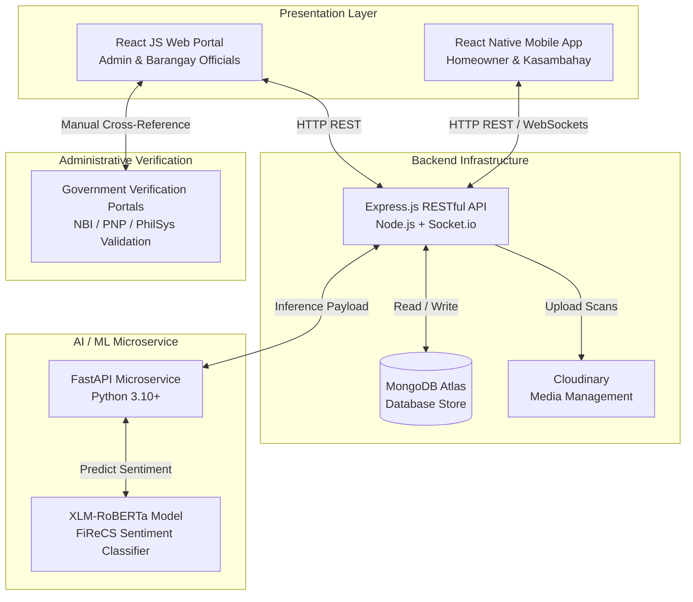

<div align="center">
  
  <h1>SerbiSure</h1>
  <p><b>A Mobile Application for Connecting Homeowners with Verified Kasambahay</b></p>

  <p>
    <a href="https://reactnative.dev/"></a>
    <a href="https://expo.dev/"></a>
    <a href="https://www.typescriptlang.org/"></a>
    <a href="https://nodejs.org/"></a>
    <a href="https://expressjs.com/"></a>
    <a href="https://mongodb.com/"></a>
    <a href="https://fastapi.tiangolo.com/"></a>
    <a href="https://huggingface.co/ccosme/FiReCS"></a>
    <a href="LICENSE"></a>
  </p>

  <p><i>"Bridging informal domestic labor and statutory compliance under Republic Act No. 10361 (Batas Kasambahay) through dual-tier hiring, biometric verification, and NLP sentiment analytics."</i></p>
</div>

---

> [!IMPORTANT]
> **SerbiSure** is an IT Capstone Research Project developed by Information Technology researchers at the **University of Science and Technology of Southern Philippines (USTP) – Cagayan de Oro City**. It directly addresses the Philippine domestic labor compliance gap where 97.5% of 1.4 million domestic workers operate without formal employment contracts, advancing **UN Sustainable Development Goals (SDG 8: Decent Work & Economic Growth, SDG 10: Reduced Inequalities, and SDG 16: Peace, Justice, & Strong Institutions)**.

---

## 📋 Table of Contents
- [📖 Project Overview](#-project-overview)
- [⚖️ Comparative Analysis of Existing Systems](#️-comparative-analysis-of-existing-systems)
- [👨‍💻 Research Team & Institution](#-research-team--institution)
- [🛠️ Tech Stack & System Requirements](#️-tech-stack--system-requirements)
- [✨ Core Modules & Key Features](#-core-modules--key-features)
- [🤖 NLP Sentiment Analysis Engine](#-nlp-sentiment-analysis-engine)
- [🏗️ System Architecture & Data Flow](#️-system-architecture--data-flow)
- [🗄️ Database Design (ERD)](#️-database-design-erd)
- [🚀 Getting Started & Setup Guide](#-getting-started--setup-guide)
- [🏛️ Legal & Ethical Considerations](#️-legal--ethical-considerations)
- [📄 License](#-license)

---

## 📖 Project Overview

In the Philippines, the domestic labor market operates in a critical state of failure. According to data from the Department of Labor and Employment (DOLE) and the Philippine Statistics Authority (PSA), only **2.5% of the country's 1.4 million domestic workers possess a written employment contract**, leaving **97.5% operating in an unregulated shadow economy**. Furthermore, only 41% of domestic workers are aware of *Batas Kasambahay* rights. 

At the local government level, traditional registration relies on manual, paper-dependent processes (Kasambahay Masterlists - KR Forms 1 to 3 under DILG Memorandum Circular No. 2013-61). In urban centers like Cagayan de Oro City, spatial isolation caused by gated subdivisions prevents barangay personnel from conducting house-to-house surveys, leaving Local Government Units (LGUs) completely blind to domestic employment within their jurisdictions.

**SerbiSure** resolves this operational deficit by establishing a centralized digital recruitment marketplace with automated legal safeguards:

1. **Dual-Tier Engagement Engine**: Manages two distinct hiring pipelines:
   - **Formal Kasambahay (Long-term)**: Full-time/regular household employment with automated statutory benefit compliance tracking (SSS, PhilHealth, Pag-IBIG, 13th-month pay, minimum wage under RA 10361).
   - **Short-Term On-Demand Services**: Task-based household engagements (Cleaning, Cooking, Child Care, Caregiving, Laundry, and All-around).
2. **Programmatic Booking Frequency Cap**: Enforces an algorithmic rule restricting short-term bookings between the same employer-worker pair to a maximum of **3 bookings per month**. Exceeding this threshold triggers a system block, forcing the employer to execute a regulated long-term Kasambahay contract under RA 10361 to prevent labor misclassification.
3. **Bilateral Verification Gateway**: Requires homeowners to submit a valid National ID and domestic workers to upload NBI and PNP clearances. Paired with native Google MediaPipe face liveness verification, profile activation is strictly restricted until administrative validation is completed.
4. **NLP Sentiment Engine**: Analyzes unstructured user reviews (in English, Tagalog, and Taglish) using a fine-tuned `xlm-roberta-base` Transformer model trained on the FiReCS dataset to generate objective sentiment scores (Positive, Neutral, Negative) on digital resumes.
5. **Restricted Kasambahay Workforce Analytics**: Provides authorized Barangay Officials and System Administrators with a web analytics dashboard, replacing manual paper registries with real-time demographic distribution data while safeguarding worker privacy under RA 10173.

---

## ⚖️ Comparative Analysis of Existing Systems

| Functionality | SerbiSure | Facebook Groups | HelperChoice | Maidsplus PH | Kazam PH | TaskRabbit |
| :--- | :---: | :---: | :---: | :---: | :---: | :---: |
| **Mobile App (iOS/Android)** | `✓` | `✓` | `✓` | `✓` | `✓` | `✓` |
| **Multi-Language (Bisaya/Tagalog/English)** | `✓` | `✓` | `✓` | `✓` | `✓` | `✕` |
| **Bilateral Verification (NBI/Police/National ID)** | `✓` | `✕` | `✓` | `✓` | `✓` | `✓` |
| **NLP Sentiment Feedback Engine** | `✓` | `✕` | `✕` | `✕` | `✕` | `✕` |
| **Programmatic Booking Frequency Cap** | `✓` | `✕` | `✕` | `✕` | `✕` | `✕` |
| **Employment Status Toggle** | `✓` | `✕` | `✕` | `✕` | `✕` | `✕` |
| **Kasambahay Workforce Analytics (LGU Portal)** | `✓` | `✕` | `✕` | `✕` | `✕` | `✕` |

---

## 👨‍💻 Research Team & Institution

Developed at the **Department of Information Technology**, College of Information and Computing, **University of Science and Technology of Southern Philippines (USTP)**, Cagayan de Oro City.

### Capstone Researchers:
- **Rhoydel Jr. Elan**
- **Gerald Llorente**
- **Nil Xandrea Montejo**
- **Daven Austhine Sumagang**
- **James Christopher C. Tagupa**

**Pilot Locale**: Cagayan de Oro City, Philippines (Barangay Pagatpat & Barangay Canitoan).

---

## 🛠️ Tech Stack & System Requirements

### Software Stack

| Layer | Component | Technology | Operational Justification |
| :--- | :--- | :--- | :--- |
| **Presentation Tier** | Mobile App | **React Native (Expo Dev Client)** | Native cross-platform mobile execution for iOS and Android. |
| **Presentation Tier** | Web Portal | **React.js + TypeScript** | Strongly typed administrative dashboard for Barangay Officials & Superadmins. |
| **Application Tier** | Backend API | **Express.js (Node.js)** | Centralized RESTful API for request orchestration, auth, and database routing. |
| **Database Tier** | Cloud Storage | **MongoDB Atlas** | Flexible NoSQL database optimizing dynamic job postings, profiles, and reviews. |
| **Media Tier** | Media Storage | **Cloudinary** | Secure cloud storage and high-speed retrieval of NBI, Police, and National ID scans. |
| **AI / ML Microservice** | NLP Engine | **Python + FastAPI** | High-performance isolated microservice serving the transformer inference model. |
| **Real-time Messaging** | WebSockets | **Socket.io** | Full-duplex WebSocket connection for instant chat messaging. |
| **Biometric Security** | Frame Processor | **Google MediaPipe Landmarker** | Native frame processing layer for real-time face liveness detection. |

### Minimum Hardware Specifications

- **Mobile Device**: Android 8.0+ / iOS 12+, Quad-Core/Octa-Core Processor, 4GB RAM, 64GB Storage, Wi-Fi or 4G/LTE connectivity.
- **Server**: Node.js 18+ runtime environment, Python 3.10+ microservice environment.

---

## ✨ Core Modules & Key Features

### 1. 🛂 Bilateral Verification & MediaPipe Liveness Gateway
- **Homeowner Onboarding**: Uploads a valid PhilSys National ID.
- **Kasambahay Onboarding**: Uploads NBI Clearance and Police Clearance.
- **Biometric Liveness Detection**: Integrated Google MediaPipe Face Landmarker requires real-time interactive steps (face centering, head turns left/right, 3-second stability countdown) to eliminate static photo spoofing.

### 2. 🃏 Swipeable Card Deck Matchmaking
- Tinder-style swipe cards deck for **Homeowner Services** & **Kasambahay Job Openings**.
- Side action buttons for quick candidate pass/like and floating bottom action buttons for instant chat and bookmarks.
- Filter chips: `Stay-in`, `Part-time`, `Nearby`, `Top Rated`, `Cleaning`, `Cooking`.

### 3. 🛡️ Programmatic Booking Frequency Cap (RA 10361 Compliance)
- Automatically tracks booking counts between employer-worker pairs.
- Hard-caps short-term engagements at **3 per month**, preventing employers from continuously booking regular workers as temporary labor to evade statutory benefits (SSS, PhilHealth, Pag-IBIG, 13th-month pay).

### 4. ⚖️ Fair Wage Compliance Guard
- Integrates regional minimum wage guidelines mandated by the **Regional Tripartite Wages and Productivity Board (RTWPB-10)**.
- Automatically displays a warning alert if a posted salary offer falls below the legal minimum wage baseline.

### 5. 🤖 Natural Language Processing (NLP) Sentiment Analysis
- Fine-tuned `xlm-roberta-base` model trained on 10,487 code-switched reviews from the **FiReCS** dataset (Krippendorff's $\alpha = 0.83$).
- Categorizes written user feedback into **Positive**, **Neutral**, or **Negative** sentiment scores.
- Displays an aggregate **Client/Worker Sentiment Bar** (e.g., `86% Positive`) on public digital resumes, giving workers empirical leverage during wage negotiations.

### 6. 📊 Restricted Kasambahay Workforce Analytics (LGU Dashboard)
- Web-based admin dashboard exclusively for **Barangay Officials** and **Superadmins**.
- Replaces paper-based KR Form 1–3 masterlists with visual donut/bar charts showing total registered, active, and available workers per barangay.
- Interactive **Verification Queue** with document previews for admin clearance approval/rejection.

---

## 🤖 NLP Sentiment Analysis Engine

The sentiment analysis module processes code-switched text (Tagalog, Taglish, English) submitted in user reviews:

### Dataset Split & Model Development Pipeline
```
1. Data Compilation (FiReCS Dataset - 10,487 reviews, Hugging Face ccosme/FiReCS)
   └── 2. Preprocessing & Subword Tokenization (xlm-roberta-base, seed=42, max_length=128)
         └── 3. Stratified K-Fold Cross-Validation (Preserving class ratios across folds)
               └── 4. Hyperparameter Optimization (Bayesian optimization via TPE algorithm)
                     └── 5. Model Evaluation (Macro-averaged Accuracy, Precision, Recall, F1-Score)
                           └── 6. Model Serialization & FastAPI Deployment
```

### Statistical Evaluation Formulas

$$\text{Accuracy} = \frac{TP + TN}{TP + TN + FP + FN}$$

$$\text{Precision} = \frac{TP}{TP + FP}$$

$$\text{Recall} = \frac{TP}{TP + FN}$$

$$\text{Specificity} = \frac{TN}{TN + FP}$$

$$F1\text{-Score} = 2 \times \frac{\text{Precision} \times \text{Recall}}{\text{Precision} + \text{Recall}}$$

---

## 🏗️ System Architecture & Data Flow



---

## 🗄️ Database Design (ERD)

The database schema centers on `tbl_user_profile`, utilizing foreign key constraints across nine core collections:

| Collection Name | Key Fields | Description |
| :--- | :--- | :--- |
| `tbl_credentials` | `credentials_id`, `email`, `password`, `account_type`, `verification_status` | System authentication and role definition. |
| `tbl_user_profile` | `user_profile_id`, `firstname`, `lastname`, `city`, `province`, `contact_number` | Primary profile information for all users. |
| `tbl_document` | `document_id`, `document_type`, `document_url`, `valid_until` | Uploaded NBI, Police, and National ID clearances. |
| `tbl_booking` | `booking_id`, `poster_id`, `booking_type`, `service_category`, `start_time` | Job postings and booking requests. |
| `tbl_booking_assignment` | `booking_assignment_id`, `booking_id`, `accepter_id`, `accepted_at` | Junction table mapping accepted jobs to workers. |
| `tbl_review` | `review_id`, `booking_id`, `reviewer_id`, `unstructured_feedback`, `nlp_sentiment` | Ratings and categorized NLP sentiment results. |
| `tbl_chat_message` | `chat_message_id`, `sender_id`, `receiver_id`, `message_payload` | Peer-to-peer WebSocket conversation logs. |
| `tbl_notification` | `notification_id`, `sender_id`, `receiver_id`, `notification_state` | System alerts and transaction notifications. |
| `tbl_admin_credentials` | `admin_credentials_id`, `email`, `account_type`, `barangayName` | Superadmin and Barangay Official accounts. |

---

## 🚀 Getting Started & Setup Guide

### Prerequisites
- **Node.js**: `v18.x` or higher
- **npm**: `v9.x` or higher
- **Android Studio**: With SDK Build-Tools, Platform-Tools, and NDK installed
- **Java Development Kit (JDK)**: `JDK 17`
- **Android Device / Emulator**: USB Debugging enabled

### Installation Steps

1. **Clone the repository**:
   ```bash
   git clone https://github.com/davenarchives/SerbiSure.git
   cd SerbiSure
   ```

2. **Install node dependencies**:
   ```bash
   npm install
   ```

3. **Configure local Android SDK path**:
   Create a `local.properties` file inside the `android/` directory:
   ```properties
   sdk.dir=C\:\\Users\\YOUR_USERNAME\\AppData\\Local\\Android\\Sdk
   ```

4. **Build the Custom Expo Development Client**:
   ```bash
   npm run android:build
   ```

5. **Install APK & Reverse Port to ADB**:
   ```bash
   adb install -r android/app/build/outputs/apk/debug/app-debug.apk
   adb reverse tcp:8082 tcp:8082
   ```

6. **Start Metro Development Server**:
   ```bash
   npx expo start --dev-client --port 8082 --clear
   ```

---

## 🏛️ Legal & Ethical Considerations

SerbiSure operates in full cognizance of Philippine regulatory frameworks:
- **Republic Act No. 10361** (*Batas Kasambahay / Domestic Workers Act*)
- **Republic Act No. 10173** (*Data Privacy Act of 2012*)
- **Republic Act No. 8759** (*Public Employment Service Office Act*)
- **DILG Memorandum Circular No. 2013-61** (*Kasambahay Masterlist Regulations*)
- **RTWPB-10 Wage Orders** (*Regional Tripartite Wages and Productivity Board*)

---

## 📄 License

This project is licensed under the **MIT License** — see the [LICENSE](LICENSE) file for details.

---

<div align="center">
  <p>Made with ❤️ by the <b>USTP SerbiSure Capstone Research Team</b></p>
  <p>Department of Information Technology • USTP Cagayan de Oro City • 2026</p>
</div>
